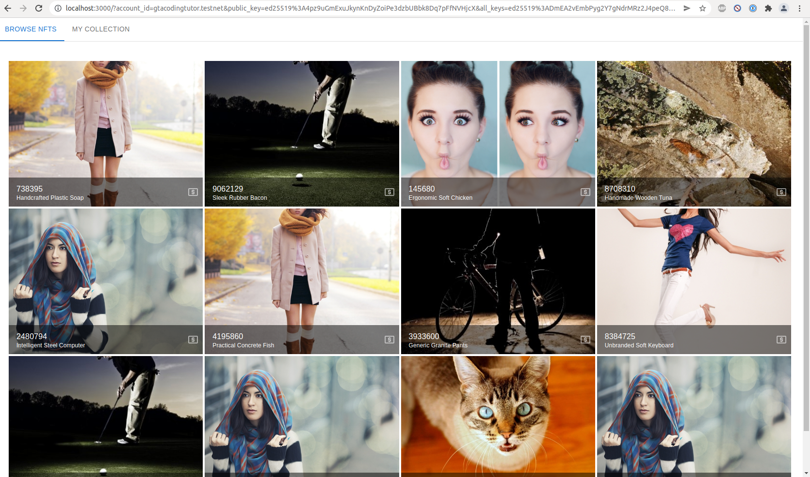
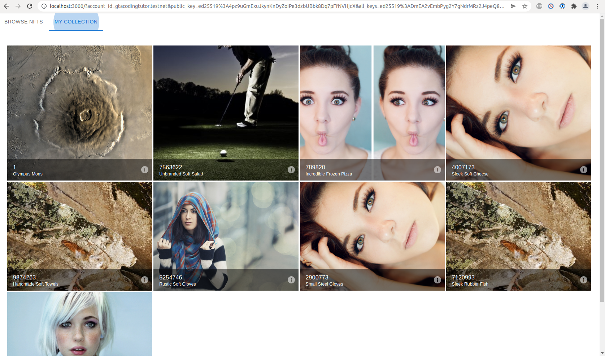

## The published contract is here - 
https://explorer.testnet.near.org/accounts/dev-1644038625906-15095311362465

### The first challenge is here: 
https://github.com/sccheruku/encode-club/tree/main/challenge-1
It is forked from the encode hackathon challenge. But I added 2 files below - 

### The first challenge contains 2 shell scripts. 
`challenge-1/submission-quick.sh` -> This file contains my steps using the quick method of publishing a contract and minting/transfering nft. 
`challenge-1/submission-standard.sh` -> This file contains my steps using `near login` to publish the contract with your existing testnet account. 

### The second challenge is here: 
https://github.com/sccheruku/encode-club/tree/main/challenge-2/nft-frontend

This folder contains a next.js app that communicates with the contract deployed in the first challenge. 

`challenge-2/nft-frontend/pages/api/nfts.js` is the backend api endpoint to randomly generate some "nft" data to allow populating the screen. 

*Please note that I am using **placeimg.com** so the images will change when the browser refreshes*

`challenge-2/nft-frontend/pages/api/nft.js` is the backend api endpoint to request minting the NFT. This method connects to the contract with the contract owner credentials, mints and transfers the NFT. 

The project can be started by running `npm run dev` The webpage will be available on `http://localhost:3000/`

This page contains two tabs - `Available NFTs`, and `My Collection`

#### Available NFTs

#### My Collection

### The third and forth Challenges are here: 
https://github.com/sccheruku/encode-club/tree/main/challenge-3/hello-world

To be honest, I just modifed `challenge-3/hello-world/contract/src/lib.rs` to save the name of the wallet's owner that's provided to the frontend. This is what I understood in the third challenge. 
The contract address is here: https://explorer.testnet.near.org/accounts/dev-1644075225201-18356097003252

The forth challenge is utilizing the frontend to communicate with the contract. However, I realized I did not have to modify the code much. The frontend was retrieving the `name` value from the blockchain and showing it on the screen. 
